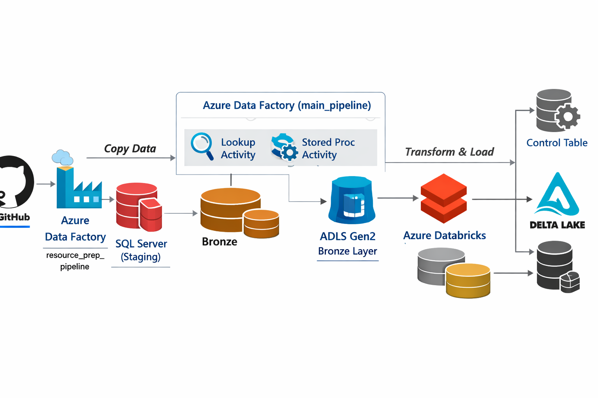

# End-to-End Azure Data Engineering Project

This project implements an end-to-end data engineering pipeline using Azure services, starting with data ingestion from GitHub into SQL Server via Azure Data Factory. A main ADF pipeline then processes the data and loads it into Azure Data Lake Storage Gen2 (Bronze layer). The pipeline uses incremental loading with Lookup and Stored Procedure activities to ensure only new data is processed. Azure Databricks is used to transform the data from Bronze to Silver and then to Gold layers using Delta Lake. The Silver layer contains cleaned and structured data, while the Gold layer provides aggregated, business-ready insights. This architecture ensures scalability, efficiency, and production-level data processing.

---

## ⚙️ Tech Stack
&nbsp;&nbsp;&nbsp;➤Azure Data Factory <br>
&nbsp;&nbsp;&nbsp;➤SQL Server <br>
&nbsp;&nbsp;&nbsp;➤ADLS Gen2<br>
&nbsp;&nbsp;&nbsp;➤Azure Databricks <br>
&nbsp;&nbsp;&nbsp;➤Delta Lake<br>

---

## ARCHITECTURE

GitHub → ADF → SQL Server → ADF → ADLS (Bronze) → Databricks → Silver → Gold



---

## PIPELINES
The project uses two Azure Data Factory pipelines to implement an incremental data processing workflow. The resource_prep_pipeline ingests data from GitHub into SQL Server as a staging layer. The main_pipeline uses two Lookup activities to fetch the last load timestamp and current maximum timestamp for watermark-based incremental loading. Only new data is loaded into the ADLS Gen2 Bronze layer and then transformed using Azure Databricks into Silver and Gold layers. Finally, the watermark is updated to ensure efficient and accurate processing in subsequent runs.

## 1. resource_prep_pipeline (Data Ingestion Pipeline)🔄
This pipeline is responsible for extracting raw data from GitHub and loading it into SQL Server, which acts as a staging layer.

### Activities Used:
&nbsp;&nbsp;&nbsp;🔸Copy Activity <br>
### ⚙️ Workflow:<br> 

&nbsp;&nbsp;&nbsp;-1.Connects to the GitHub dataset (CSV/JSON format).<br>
&nbsp;&nbsp;&nbsp;-2.Extracts raw data using HTTP/REST connector.<br>
&nbsp;&nbsp;&nbsp;-3.Loads the data into SQL Server staging tables.<br>
### 🎯 Purpose:<br>
&nbsp;&nbsp;&nbsp;-1.Establishes a structured and reliable source for downstream processing.<br>
&nbsp;&nbsp;&nbsp;-2.Decouples raw data ingestion from transformation logic.<br>

## 2. main_pipeline (Core Processing Pipeline)🔄

This pipeline implements a **watermark-based incremental loading strategy** using two Lookup activities to track previous and current load states.

### Activities Used:<br>

### 🔸1: Lookup Activity (Last Load)

* Fetches the **last successful load timestamp** (`last_load_time`) from the control (watermark) table in SQL Server.
* This value represents the previous pipeline execution point.


### 🔸2: Lookup Activity (Current Load)

* Retrieves the **current maximum timestamp** (`current_load_time`) from the source SQL Server table.
* This ensures the pipeline processes data only within a defined range.

### 🔸3: Incremental Copy Activity (SQL → Bronze)

* Uses both timestamps to filter data:

  * `last_load_time` → Lower bound
  * `current_load_time` → Upper bound

#### Query Logic:

```sql
select * from source_car_data
 where
 Date_ID > '@{activity('Last_load').output.value[0].last_load}' AND
 Date_ID <= '@{activity('Current_load').output.value[0].max_date}'
```

* Loads only incremental data into the Bronze layer in ADLS Gen2.

### 🔸4: Stored Procedure Activity

* Updates the control (watermark) table with the new `current_load_time`.
* Ensures the next pipeline run continues from the correct point.

### ⚙️ Workflow:<br>
&nbsp;&nbsp;1.Retrieves the last processed timestamp from the control (watermark) table.<br>
&nbsp;&nbsp;2.Fetches the current maximum timestamp from the source SQL Server table.<br>
&nbsp;&nbsp;3.Filters and extracts only the incremental data based on these timestamps.<br>
&nbsp;&nbsp;4.Loads the filtered data into the Bronze layer in ADLS Gen2.<br>
&nbsp;&nbsp;5.Updates the watermark table with the latest timestamp after successful execution.<br>

### 🎯 Purpose:
&nbsp;&nbsp;1.Implement incremental data loading using watermark logic<br>
&nbsp;&nbsp;2.Process only new or updated records from SQL Server<br>
&nbsp;&nbsp;3.Reduce data duplication and improve pipeline efficiency<br>
&nbsp;&nbsp;4.Ensure data consistency across pipeline runs<br>
&nbsp;&nbsp;5.Maintain and update the control (watermark) table<br>

---

## 🔁 Incremental Load Strategy (Watermark Logic)

This pipeline implements a range-based incremental loading approach using a watermark mechanism to efficiently process only new or updated data.

### 📌 Concept:
&nbsp;&nbsp;&nbsp;&nbsp;1.last_load_time → Represents the start of the data window (last successful pipeline run)<br>
&nbsp;&nbsp;&nbsp;&nbsp;2.current_load_time → Represents the end of the data window (latest available data in source)<br>
### ⚙️ Workflow:
&nbsp;&nbsp;&nbsp;&nbsp;1.The pipeline first reads the previous watermark value (last_load_time) from the control table.<br>
&nbsp;&nbsp;&nbsp;&nbsp;2.It then captures the current maximum timestamp (current_load_time) from the source SQL Server table.<br>
&nbsp;&nbsp;&nbsp;&nbsp;3.Using these two values, the pipeline extracts only the data that falls between this time range, ensuring that only new or updated records are processed.<br>
&nbsp;&nbsp;&nbsp;&nbsp;4.The filtered data is loaded into the target layer (Bronze in ADLS Gen2).<br>
&nbsp;&nbsp;&nbsp;&nbsp;5.After successful execution, the pipeline updates the watermark table with the latest processed timestamp (current_load_time) for the next run.<br>

---

### 📊 Data Layers & Databricks Notebook Details
The project follows the Medallion Architecture (Bronze, Silver, Gold) using Azure Databricks and Delta Lake for scalable data transformation.

## 🟤 Bronze Layer (Raw Data)
### 🎯 Purpose:<br>
&nbsp;&nbsp;&nbsp;&nbsp;➤Store raw, unprocessed data exactly as ingested<br>
&nbsp;&nbsp;&nbsp;&nbsp;➤Act as a single source of truth<br>
### ⚙️ Notebook Logic:<br>
&nbsp;&nbsp;&nbsp;&nbsp;➤Read data from ADLS Gen2 Bronze container<br>
&nbsp;&nbsp;&nbsp;&nbsp;➤No major transformations applied<br>
&nbsp;&nbsp;&nbsp;&nbsp;➤Preserve original schema and structure<br>

### 🧪 Sample Code:<br>

```py

df = spark.read.format("csv").option("header", "true").load("/mnt/bronze/data/")
df.write.format("delta").mode("overwrite").save("/mnt/bronze/delta/")

```

### 📌 Key Points:<br>
&nbsp;&nbsp;&nbsp;&nbsp;➤Data is stored in Delta format<br>
&nbsp;&nbsp;&nbsp;&nbsp;➤Supports schema evolution<br>
&nbsp;&nbsp;&nbsp;&nbsp;➤Used for auditing and reprocessing<br>

## ⚪ Silver Layer (Cleaned Data)<br>
### 🎯 Purpose:<br>
&nbsp;&nbsp;&nbsp;&nbsp;➤Clean and standardize the raw data<br>
&nbsp;&nbsp;&nbsp;&nbsp;➤Remove inconsistencies and duplicates<br>
### ⚙️ Notebook Logic:<br><br>
&nbsp;&nbsp;&nbsp;&nbsp;➤Handle missing/null values<br>
&nbsp;&nbsp;&nbsp;&nbsp;➤Remove duplicates<br>
&nbsp;&nbsp;&nbsp;&nbsp;➤Convert data types<br>
&nbsp;&nbsp;&nbsp;&nbsp;➤Normalize column names<br>
### 🧪 Sample Code:<br>

```py

df = spark.read.format("delta").load("/mnt/bronze/delta/")

df = df.dropDuplicates()
df = df.dropna()

from pyspark.sql.functions import col
df = df.withColumn("id", col("id").cast("int"))

```

df.write.format("delta").mode("overwrite").save("/mnt/silver/")
### 📌 Key Points:<br>
&nbsp;&nbsp;&nbsp;&nbsp;➤Data becomes clean and reliable<br>
&nbsp;&nbsp;&nbsp;&nbsp;➤Ready for further transformation<br>
&nbsp;&nbsp;&nbsp;&nbsp;➤Improves data quality<br>
## 🟡 Gold Layer (Business-Level Data)
### 🎯 Purpose:<br>
&nbsp;&nbsp;&nbsp;&nbsp;➤Create analytics-ready datasets<br>
&nbsp;&nbsp;&nbsp;&nbsp;➤Apply business logic and aggregations<br>
### ⚙️ Notebook Logic:<br>
&nbsp;&nbsp;&nbsp;&nbsp;➤Perform aggregations (c<br>ount, sum, avg)<br>
&nbsp;&nbsp;&nbsp;&nbsp;➤Create KPI-level tables<br>
&nbsp;&nbsp;&nbsp;&nbsp;➤Optimize for reporting<br>
### 🧪 Sample Code:<br>

```py

df = spark.read.format("delta").load("/mnt/silver/")

from pyspark.sql.functions import count

gold_df = df.groupBy("category").agg(count("*").alias("total_count"))

gold_df.write.format("delta").mode("overwrite").save("/mnt/gold/")

```

### 📌 Key Points:<br>
&nbsp;&nbsp;&nbsp;&nbsp;➤Data is optimized for BI tools and reporting<br>
&nbsp;&nbsp;&nbsp;&nbsp;➤Supports fast querying<br>
&nbsp;&nbsp;&nbsp;&nbsp;➤Used by analysts and business users<br>


